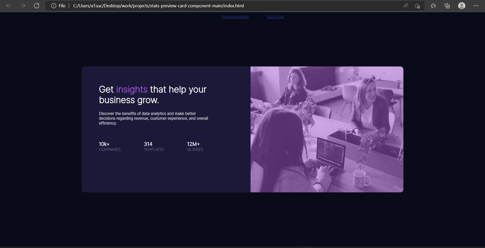

# Frontend Mentor - Stats preview card component solution

This is a solution to the [Stats preview card component challenge on Frontend Mentor](https://www.frontendmentor.io/challenges/stats-preview-card-component-8JqbgoU62). Frontend Mentor challenges help you improve your coding skills by building realistic projects. 

## Table of contents

- [Overview](#overview)
  - [The challenge](#the-challenge)
  - [Screenshot](#screenshot)
  - [Links](#links)
- [My process](#my-process)
  - [Built with](#built-with)
  - [What I learned](#what-i-learned)
  - [Continued development](#continued-development)
  - [Useful resources](#useful-resources)
- [Author](#author)

## Overview

### The challenge

Users should be able to:

- View the optimal layout depending on their device's screen size

### Screenshot



### Links

- Solution URL: (https://github.com/adebimpecole/stats-preview-card-component-main.git)
- Live Site URL: (https://legendary-khapse-9da717.netlify.app/)

## My process

### Built with

- Semantic HTML5 markup
- CSS custom properties
- Flexbox
- CSS Grid
- Mobile-first workflow


### What I learned

I learnt how to make use of grid and change my case in html.

```css
.foot{
  text-transform: uppercase;
}
.card{
  display: grid;
  grid-auto-flow: row dense;
}
```

### Continued development

- Use of Grid.

### Useful resources

- [Example resource 1](https://www.w3schools.com/cssref/pr_text_text-transform.asp) - This helped me to change my text case from lower case to upper case.
- [Example resource 2](https://developer.mozilla.org/en-US/docs/Web/CSS/grid-auto-flow) - This helped me understand the use of grid.


## Author

- Website - [Mary Cole](https://www.your-site.com)
- Frontend Mentor - [@adebimpecole](https://www.frontendmentor.io/profile/adebimpecole)
- Twitter - [@adecole02](https://twitter.com/adecole02)

